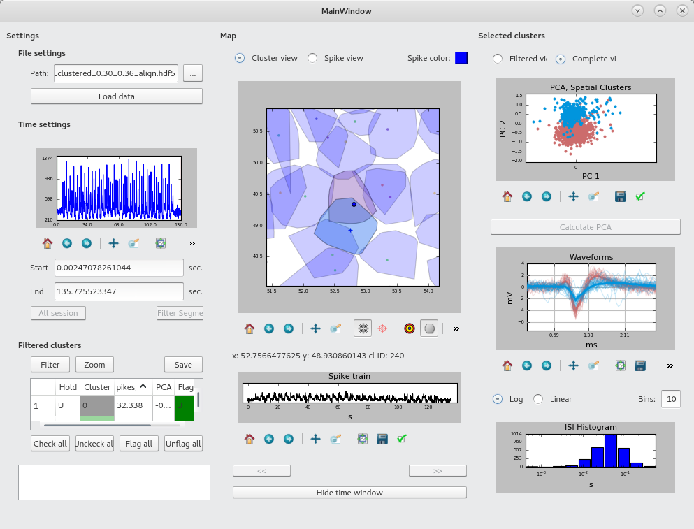

Herding Spikes
==============

Software for high density electrophysiology.


# Contents
1. [Sub-projects](#Sub-projects)
2. [How to use this software](#howtouse)
    1. [Spike detection](#detect)
    2. [Spike sorting](#sort)
    3. [Visualisation](#ui)
3. [Contributors](#people)
4. [References](#refs)

# Sub-projects <a name="Sub-projects"></a>

 - [onlineDetection](onlineDetection): Online-capable spike detection, done independently on each recording channel.
 - [interpolatingDetection](interpolatingDetection): Spike detection with spatial interpolation. Returns cut-outs for detected events from multiple channels, which allows performing spike localisation.
 - [postProcessing](postProcessing): Programs for removing duplicate events in spikes detected with the online method, and localise spikes detected with the interpolation method.
 - [clustering](clustering): Perform spike sorting by location and PCA on interpolated data.
 - [visualisationtool](visualisationtool): A basic GUI tool for visualising and annotating sorted spikes.

# How to use this software <a name="howtouse"></a>

If you are interested in using this software and have questions or problems, get in touch with [us](http://homepages.inf.ed.ac.uk/mhennig/index.html).

## Fast and simple spike detection <a name="detect"></a>

The project *[onlineDetection](onlineDetection)* provides an efficient and reliable algorithm for detecting spikes in single channels.
Main features are a robust noise estimate based on signal percentiles rather than moments, and fast integer based computations allowing real-time performance even when recording 1000s of channels simultaneously. While originally developed for high density multielectrode arrays, we expect this to perform well on most extracellular recordings.

The current implementation in the master branch only reads 3Brain [Brainwave](http://www.3brain.com/index.php/5/Downloads) files. You can switch to the 'detection-cpp' branch for a first working version that will accept any file format.

## Spike sorting on large scale, high density multielectrode arrays <a name="sort"></a>

This process is fully automated, as manual inspection gets very time consuming for large-scale recordings. The following steps lead all the way from raw data to sorted units:

1. Spike detection and spatial signal interpolation - currently runs in 0.1 * real time for 4000 channels, scales linearly with recording duration). Code is in the sub-project [interpolatingDetection](interpolatingDetection).

2. Spatial event localisation, now has about real-time performance (scales linearly with event number).
The relevant code is in the sub-project  [postProcessing](postProcessing).

3. Clustering, code in [clustering](clustering). This step is parallelised and extremely efficient, typical experiments with millions of spikes are clustered in minutes. The code also includes functions for noise removal and quality control.

4. Quality control, using functionality provided by the code in [clustering](clustering). A full mixture model is fit to all identified units and those in their neighbourhood, to obtain an estimate of false positives and negatives. Based on these quantities, units can be rejected as poorly sorted.

These methods have for far been tested with data recorded with the [3Brain Biocam](http://www.3brain.com/biocam-system), we would be keen to test other data sets. Steps 1 and 2 would have to be adjusted for other systems, steps 3 and 4 are already rather generic.

## Visualisation tool <a name="ui"></a>



To run the graphical interface to inspect the results of the clustering, run

```
python Launcher.py
```

in the subfolder [visualisationtool](visualisationtool). The program reads files generated by the clustering method.

# Contributors <a name="people"></a>

- [Matthias Hennig](http://homepages.inf.ed.ac.uk/mhennig/index.html): Spike sorting
- [Oliver Muthmann](mailto:ollimuh@googlemail.com): Spike detection and localisation
- [Martino Sorbaro](http://martinosorb.github.io): Spike sorting
- [Cesar Juarez Ramirez](mailto:cesaripn2@gmail.com): Visualisation toolkit

# References <a name="refs"></a>

J.-O. Muthmann, H. Amin, E. Sernagor, A. Maccione, D. Panas, L. Berdondini, U.S. Bhalla, M.H. Hennig MH (2015). [Spike detection for large neural populations using high density multielectrode arrays](http://journal.frontiersin.org/article/10.3389/fninf.2015.00028/abstract). Front. Neuroinform. 9:28. doi: 10.3389/fninf.2015.00028.

G. Hilgen, M. Sorbaro, S. Pirmoradian, J.-O. Muthmann, I. Kepiro, S. Ullo, C. Juarez Ramirez, A. Maccione, L. Berdondini, V. Murino, D. Sona, F. Cella Zanacchi, U. Bhalla, E. Sernagor, M.H. Hennig (2016). [Unsupervised spike sorting for large scale, high density multielectrode arrays.](http://dx.doi.org/10.1101/048645) bioRxiv doi: http://dx.doi.org/10.1101/048645.
